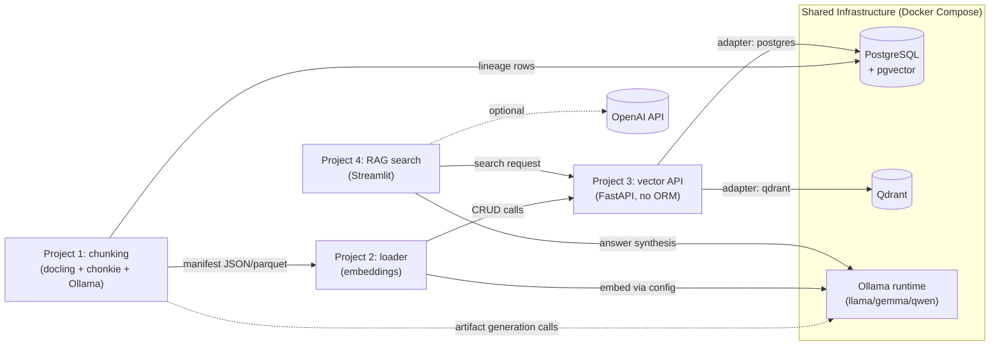
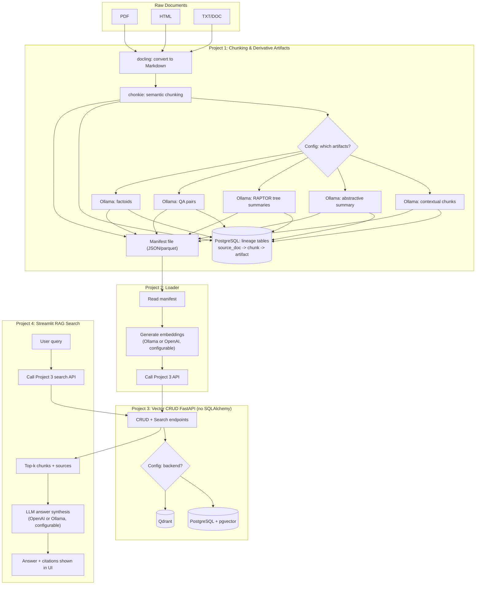

# Enterprise RAG Solution — High-Level Design Specification

## 1. Overview

This document specifies an enterprise-grade Retrieval-Augmented Generation (RAG) platform for
searching internal documents (PDF, HTML, TXT — including long, multi-page files). The solution is
split into **4 independently developable and deployable projects**, connected by a shared
PostgreSQL lineage store and a configurable vector backend (PostgreSQL+pgvector or Qdrant).

Target scale: hundreds to low-thousands of source documents (v1). No authentication in v1
(internal-only usage). Deployment via Docker Compose, one container per project/service.

## 2. Goals & Non-Goals

**Goals**
- Convert raw documents (PDF/HTML/TXT/DOC) into clean Markdown, then into multiple derivative
  artifact types (semantic chunks, contextual chunks, abstractive summaries, RAPTOR summary
  trees, QA pairs, factoids).
- Track full lineage from source document → chunk → derivative artifact → vector record.
- Store vectors in a configurable backend (PostgreSQL/pgvector or Qdrant).
- Provide a CRUD + search API with no ORM (no SQLAlchemy).
- Provide a Streamlit search UI that performs full RAG: retrieve top-k chunks, then synthesize a
  cited answer using a configurable LLM (OpenAI or Ollama).
- Allow each of the 4 projects to be built, tested, and deployed independently.

**Non-Goals (v1)**
- Authentication / multi-tenant access control.
- Massive-scale distributed batch processing (design should not preclude it later, but is not
  required now).
- Detailed field-by-field API schemas, CI/CD pipeline design, load testing — covered in later
  detailed design docs, not here.

## 3. Architecture Overview



### Data flow, end to end



## 4. Repository / Folder Layout

```
AI_Scratch_1/                          # monorepo root
├── SPEC.md                            # this design document
├── docker-compose.yml                 # orchestrates all services
├── .env                               # shared secrets/config (provider selection, DB creds)
│
├── project1-chunking/                 # docling + chonkie + Ollama artifact generation
│   ├── config/
│   │   └── artifact_config.yaml       # per-doc-type: which artifacts to generate
│   ├── src/
│   │   ├── convert/                   # docling: PDF/HTML/TXT -> Markdown
│   │   ├── chunk/                     # chonkie: semantic chunking
│   │   ├── artifacts/                 # Ollama-prompted: contextual, RAPTOR, summary, QA, factoids
│   │   ├── lineage/                   # writes source_doc -> chunk -> artifact rows to Postgres
│   │   └── manifest/                  # emits JSON/parquet manifest for project 2
│   ├── tests/
│   └── Dockerfile
│
├── project2-loader/                   # reads manifest, embeds, pushes to vector API
│   ├── src/
│   │   ├── manifest_reader/
│   │   ├── embedding/                 # Ollama or OpenAI, config-driven
│   │   └── api_client/                # calls project3 FastAPI CRUD endpoints
│   ├── tests/
│   └── Dockerfile
│
├── project3-vector-api/               # FastAPI CRUD, no SQLAlchemy
│   ├── src/
│   │   ├── api/                       # routers: documents, chunks, artifacts, search
│   │   ├── adapters/
│   │   │   ├── postgres_pgvector/     # raw SQL via psycopg/asyncpg
│   │   │   └── qdrant/                # qdrant-client
│   │   ├── config/                    # backend selection (postgres | qdrant)
│   │   └── schemas/                   # Pydantic request/response models
│   ├── tests/
│   └── Dockerfile
│
└── project4-rag-search/               # Streamlit UI
    ├── src/
    │   ├── ui/                        # search box, results, citations
    │   ├── retrieval/                 # calls project3 search endpoint
    │   └── generation/                # LLM answer synthesis, OpenAI or Ollama
    ├── tests/
    └── Dockerfile
```

## 5. Project 1 — Chunking & Derivative Artifacts

**Purpose:** turn raw documents into Markdown, then into multiple derivative artifact types, while
recording full lineage.

**Pipeline stages**
1. **Convert** (docling): PDF/HTML/DOC/TXT → clean Markdown. Long multi-page documents are kept
   as a single normalized Markdown document with section/page markers preserved for traceability.
2. **Semantic chunk** (chonkie): split the Markdown into semantically coherent chunks.
3. **Derivative artifacts** (Ollama, on-prem models — llama/gemma/qwen), each individually
   toggleable per document type via `artifact_config.yaml`:
   - Contextual chunks (chunk + surrounding context window).
   - Abstractive summary (per-document or per-section).
   - RAPTOR — recursive cluster-and-summarize tree of chunk summaries, built via repeated Ollama
     summarization prompts over chunk clusters.
   - QA pairs — Ollama-generated question/answer pairs per chunk.
   - Factoids — Ollama-extracted atomic factual statements per chunk.

**Lineage tracking (PostgreSQL)**
Project 1 writes directly to Postgres lineage tables as it processes each document — see
[Section 9, Schema Details](#9-schema-details) for full DDL.

| Table | Purpose |
|---|---|
| `source_document` | one row per ingested raw file (path, type, checksum, converted_at) |
| `chunk` | one row per semantic chunk (source_document_id, chunk_index, text, char span) |
| `artifact` | one row per derivative artifact (chunk_id or source_document_id, artifact_type, text, generated_by model) |
| `vector_record` | one row per embedded vector (artifact_id, vector_backend, external_vector_id) — populated later by Project 2/3 |

`artifact_type` enum: `semantic_chunk | contextual_chunk | abstractive_summary | raptor_summary | qa_pair | factoid`.

**Output:** a manifest file (JSON or parquet) per processing batch, containing references to all
chunks/artifacts and their lineage IDs — this is the handoff contract to Project 2. No direct
coupling between Project 1 and Project 2 beyond this file. See [Section 9](#9-schema-details) for
the manifest schema.

## 6. Project 2 — Loader

**Purpose:** read Project 1's manifest, generate embeddings, and persist vectors + metadata via
Project 3's API.

**Flow**
1. Read manifest (JSON/parquet), resolve artifact records to embed.
2. Generate embeddings using the configured provider (Ollama local embedding model, e.g.
   `nomic-embed-text`, or OpenAI embeddings) — provider selected via config, not hardcoded.
3. Call Project 3 CRUD endpoints to create vector records, passing lineage IDs so Project 3 can
   update `vector_record.external_vector_id`.
4. Idempotent by lineage ID — reprocessing a manifest should not create duplicate vectors.

## 7. Project 3 — Vector CRUD API (FastAPI, no SQLAlchemy)

> See [Section 9, Schema Details](#9-schema-details) for the pgvector table DDL and Qdrant
> collection/payload schema used by this project's adapters.

**Purpose:** single API surface for storing/querying documents, chunks, artifacts, and vectors,
backed by a configurable store.

**Constraints**
- No ORM (no SQLAlchemy). PostgreSQL access via raw SQL using `psycopg`/`asyncpg`. Qdrant access
  via `qdrant-client`.
- Backend selected via config (`VECTOR_BACKEND=postgres|qdrant`), implemented with a
  repository/adapter pattern so routers are backend-agnostic.
- Pydantic models for all request/response schemas.

**Endpoints (high level)**
- `POST/GET/PUT/DELETE /documents`
- `POST/GET/PUT/DELETE /chunks`
- `POST/GET/PUT/DELETE /artifacts`
- `POST /vectors` (upsert vector + lineage link), `DELETE /vectors/{id}`
- `POST /search` — vector similarity search (top-k, filterable by artifact_type/doc metadata),
  returns chunks/artifacts with source document references.

## 8. Project 4 — RAG Search (Streamlit)

**Purpose:** end-user search UI performing full RAG.

**Flow**
1. User enters a query.
2. Call Project 3 `/search` to retrieve top-k relevant chunks/artifacts.
3. Pass retrieved context + query to the configured LLM (OpenAI or Ollama, selected via config) to
   synthesize a natural-language answer.
4. Display the answer with citations linking back to source documents (and optionally show the
   raw retrieved chunks for transparency).

## 9. Schema Details

### 9.1 PostgreSQL lineage schema (all backends)

These tables exist regardless of `VECTOR_BACKEND` — they are the system of record for lineage.
When `VECTOR_BACKEND=postgres`, `vector_record.embedding` additionally holds the pgvector value;
when `VECTOR_BACKEND=qdrant`, `vector_record.external_vector_id` points to the Qdrant point ID.

```sql
CREATE TYPE artifact_type AS ENUM (
    'semantic_chunk', 'contextual_chunk', 'abstractive_summary',
    'raptor_summary', 'qa_pair', 'factoid'
);

CREATE TABLE source_document (
    id                  UUID PRIMARY KEY DEFAULT gen_random_uuid(),
    file_name            TEXT NOT NULL,
    file_path            TEXT NOT NULL,
    file_type            TEXT NOT NULL,               -- pdf | html | txt | doc
    checksum             TEXT NOT NULL UNIQUE,        -- dedupes re-ingested files
    page_count           INT,
    converted_markdown_path TEXT,                      -- docling output location on disk
    status                TEXT NOT NULL DEFAULT 'pending', -- pending|converted|chunked|failed
    ingested_at           TIMESTAMPTZ NOT NULL DEFAULT now(),
    converted_at          TIMESTAMPTZ
);

CREATE TABLE chunk (
    id                   UUID PRIMARY KEY DEFAULT gen_random_uuid(),
    source_document_id   UUID NOT NULL REFERENCES source_document(id) ON DELETE CASCADE,
    chunk_index          INT NOT NULL,                -- order of chunk within the document
    text                 TEXT NOT NULL,
    char_start           INT NOT NULL,                -- offsets into converted_markdown_path for traceability
    char_end             INT NOT NULL,
    token_count          INT,
    created_at           TIMESTAMPTZ NOT NULL DEFAULT now(),
    UNIQUE (source_document_id, chunk_index)          -- one ordering per document
);

CREATE TABLE artifact (
    id                   UUID PRIMARY KEY DEFAULT gen_random_uuid(),
    chunk_id             UUID REFERENCES chunk(id) ON DELETE CASCADE,        -- set for chunk-level artifacts
    source_document_id   UUID REFERENCES source_document(id) ON DELETE CASCADE, -- set for doc-level artifacts
    parent_artifact_id   UUID REFERENCES artifact(id) ON DELETE CASCADE, -- links RAPTOR summary to its children
    artifact_type        artifact_type NOT NULL,
    text                 TEXT NOT NULL,
    metadata             JSONB NOT NULL DEFAULT '{}', -- e.g. {"raptor_level":2,"question":"..."}
    generated_by_model   TEXT NOT NULL,               -- e.g. 'ollama:llama3.1' or 'chonkie'
    created_at           TIMESTAMPTZ NOT NULL DEFAULT now(),
    CHECK (chunk_id IS NOT NULL OR source_document_id IS NOT NULL) -- must attach to a chunk or a document
);

CREATE TABLE vector_record (
    id                   UUID PRIMARY KEY DEFAULT gen_random_uuid(),
    artifact_id          UUID NOT NULL REFERENCES artifact(id) ON DELETE CASCADE,
    vector_backend       TEXT NOT NULL,               -- 'postgres' | 'qdrant'
    external_vector_id   TEXT,                        -- Qdrant point ID (null when backend=postgres)
    embedding_model       TEXT NOT NULL,               -- e.g. 'nomic-embed-text' or 'text-embedding-3-small'
    embedding_dims        INT NOT NULL,                -- must match the VECTOR() width below
    embedding             VECTOR(768),                 -- pgvector column, used only when backend=postgres
    created_at            TIMESTAMPTZ NOT NULL DEFAULT now(),
    UNIQUE (artifact_id, vector_backend)                -- one vector per artifact per backend
);

-- lookup indexes for lineage joins and artifact-type filtering
CREATE INDEX idx_chunk_source_document ON chunk(source_document_id);
CREATE INDEX idx_artifact_chunk ON artifact(chunk_id);
CREATE INDEX idx_artifact_type ON artifact(artifact_type);
CREATE INDEX idx_vector_record_artifact ON vector_record(artifact_id);
-- ivfflat/hnsw index added separately once embedding_dims is finalized, e.g.:
-- CREATE INDEX idx_vector_embedding ON vector_record USING hnsw (embedding vector_cosine_ops);
```

### 9.2 Qdrant collection schema (when `VECTOR_BACKEND=qdrant`)

Postgres still holds `source_document`/`chunk`/`artifact` as the lineage system of record; Qdrant
holds only the vector + a denormalized payload for filtering, cross-referenced via `artifact_id`.

```jsonc
// Collection config
{
  "collection_name": "rag_artifacts",
  "vectors": { "size": 768, "distance": "Cosine" }
}

// Point payload (per vector)
{
  "artifact_id": "uuid",        // FK back to Postgres artifact.id
  "chunk_id": "uuid|null",
  "source_document_id": "uuid",
  "artifact_type": "semantic_chunk|contextual_chunk|abstractive_summary|raptor_summary|qa_pair|factoid",
  "file_name": "policy_handbook.pdf",
  "embedding_model": "nomic-embed-text"
}
```

### 9.3 Manifest file schema (Project 1 → Project 2 handoff)

```jsonc
{
  "batch_id": "uuid",
  "generated_at": "2026-08-29T12:00:00Z",
  "source_document": {
    "id": "uuid",
    "file_name": "policy_handbook.pdf",
    "file_type": "pdf",
    "checksum": "sha256:..."
  },
  "artifacts": [
    {
      "artifact_id": "uuid",
      "chunk_id": "uuid|null",
      "artifact_type": "semantic_chunk",
      "text": "...",
      "metadata": {}
    }
  ]
}
```

Parquet variant uses the same fields flattened into one row per artifact, with `batch_id` and
`source_document_*` columns repeated per row.

### 9.4 Project 3 API request/response shape (illustrative)

```jsonc
// POST /search request
{
  "query": "What is the remote work policy?",
  "top_k": 5,
  "artifact_types": ["semantic_chunk", "qa_pair"],
  "filters": { "file_name": null }
}

// POST /search response
{
  "results": [
    {
      "artifact_id": "uuid",
      "artifact_type": "semantic_chunk",
      "text": "...",
      "score": 0.83,
      "source_document": { "id": "uuid", "file_name": "policy_handbook.pdf" }
    }
  ]
}
```

## 10. Technology Stack Summary

| Project | Language/Runtime | Key Libraries | Backing Services |
|---|---|---|---|
| Project 1 — Chunking | Python | `docling` (doc→Markdown), `chonkie` (semantic chunking), `ollama` client (contextual chunks, RAPTOR, summaries, QA pairs, factoids), `psycopg`/`asyncpg` (lineage writes) | PostgreSQL, Ollama |
| Project 2 — Loader | Python | Ollama/OpenAI embedding clients, `httpx`/`requests` (calls Project 3) | Ollama, OpenAI API (optional) |
| Project 3 — Vector API | Python | FastAPI, Pydantic, `psycopg`/`asyncpg` (raw SQL, no ORM), `qdrant-client` | PostgreSQL + pgvector, Qdrant |
| Project 4 — RAG Search | Python | Streamlit, `httpx` (calls Project 3), OpenAI/Ollama chat clients | Project 3 API, Ollama, OpenAI API (optional) |

**Cross-cutting**
- Containerization: Docker + Docker Compose for all services.
- Config: `.env` + per-project `config.yaml`, no secrets hardcoded.
- No ORM anywhere in Project 3 (raw SQL only); Pydantic used for all API schemas.

## 11. Shared Conventions

- **Config strategy:** `.env` for secrets/connection strings; per-project `config.yaml` for
  feature toggles (artifact types, model provider, vector backend).
- **Provider selection pattern:** every place an LLM/embedding call is made, the provider is
  resolved from config (`MODEL_PROVIDER=ollama|openai`) behind a common interface, so swapping is
  a config change, not a code change.
- **Deployment:** `docker-compose.yml` at root defines services — `postgres` (with pgvector
  extension), `qdrant`, `ollama`, `project3-vector-api`, `project4-rag-search`. Project 1 and
  Project 2 run as on-demand CLI/batch jobs (can also be containerized) rather than long-running
  services.

## 12. Automated Testing Strategy

Every project must ship with its own automated test suite (`pytest`) that runs independently of the
other 3 projects, plus one cross-project end-to-end suite. Tests live in each project's `tests/`
folder (see [Section 4](#4-repository--folder-layout)) and run in CI on every change.

| Project | Unit tests | Integration tests | Test doubles / fixtures |
|---|---|---|---|
| Project 1 — Chunking | docling conversion output shape, chonkie chunk boundaries, artifact prompt-building logic, lineage row construction | full pipeline on 2-3 sample docs (pdf/html/txt) against a throwaway Postgres, asserting lineage rows + manifest contents | mocked Ollama client (canned responses), sample fixture docs checked into `tests/fixtures/` |
| Project 2 — Loader | manifest parsing, idempotency-key logic, provider selection (Ollama vs OpenAI) | load a sample manifest, assert correct CRUD calls made to a mocked/stubbed Project 3 API | mocked embedding provider, `httpx` mock transport for Project 3 calls |
| Project 3 — Vector API | Pydantic schema validation, adapter selection logic, SQL-building helpers | FastAPI `TestClient` hitting real endpoints against a test Postgres (pgvector) and a test Qdrant instance (via Docker Compose test profile) | ephemeral Postgres/Qdrant containers spun up in CI, seeded fixture data |
| Project 4 — RAG Search | retrieval-to-prompt formatting, citation extraction | end-to-end query against a stubbed Project 3 API and mocked LLM, asserting answer + citations rendered | mocked Project 3 responses, mocked OpenAI/Ollama chat client |
| Cross-project | — | one end-to-end smoke test: sample doc → Project 1 → 2 → 3 → query via Project 4, asserting a cited answer is returned | `docker-compose.test.yml` profile bringing up all services with test data |

**Conventions**
- All tests run via `pytest` from each project's own root (`project1-chunking/tests`, etc.).
- No test depends on live external services (real OpenAI, real Ollama) — always mocked/stubbed;
  a small number of opt-in "live" tests may exist behind an env flag for manual verification.
- Minimum bar to merge: unit tests pass for the changed project; integration tests pass in CI
  before deploying that project's container.

## 13. Verification / Acceptance Criteria

- Each project has its own automated unit + integration test suite (Section 12) and can be
  built/tested/run independently.
- End-to-end smoke test: ingest one sample PDF, one HTML, one TXT through Project 1 → 2 → 3, then
  query via Project 4 and confirm a cited answer is returned.
- `docker-compose up` brings up all shared infra + Project 3 + Project 4 successfully.
- Switching `VECTOR_BACKEND` and `MODEL_PROVIDER` config values requires no code changes.

## 14. Open Items for Refinement

- Exact embedding model names/dimensions per provider (must match vector column/collection dims).
- RAPTOR clustering parameters (branching factor, cluster algorithm).
- Retry/backoff policy for Ollama calls in Project 1 and Project 2.
- Detailed API request/response schemas for Project 3 (separate design doc).
- Long-document handling details (page/section boundary preservation through docling → chonkie).
